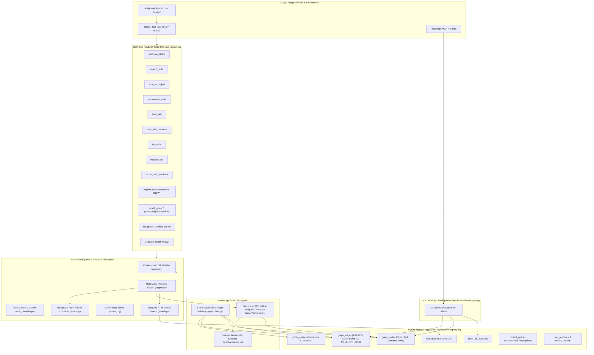

# SkillForge Evolution Program (SEP)
## Phase 3: Architecture & Module Topology Map

```mermaid
graph TD
    subgraph Antigravity ["Google Antigravity IDE & Environment"]
        Agent["Antigravity Agent / User Session"]
        RouterSkill["Router Skill (skill-library-router)"]
        PlaywrightMCP["Playwright MCP Harness"]
    end

    subgraph FastMCP ["SkillForge FastMCP Stdio Interface (server.py)"]
        ToolStatus["skillforge_status"]
        ToolSearch["search_skills"]
        ToolAnalyze["analyze_project"]
        ToolRecommend["recommend_skills"]
        ToolLoad["load_skill"]
        ToolResource["read_skill_resource"]
        ToolList["list_skills"]
        ToolValidate["validate_skill"]
        ToolFeedback["record_skill_feedback"]
        ToolExplain["explain_recommendation (NEW)"]
        ToolGraph["graph_query / graph_neighbors (NEW)"]
        ToolProfiles["list_project_profiles (NEW)"]
        ToolHealth["skillforge_health (NEW)"]
    end

    subgraph Engine ["Hybrid Intelligence & Retrieval Subsystem"]
        QueryCache["Content-Hash LRU Cache (cache.py)"]
        TaskClassifier["Task & Intent Classifier (task_classifier.py)"]
        MultiMode["Multi-Mode Retrieval Engine (engine.py)"]
        RRF["Reciprocal Rank Fusion Combiner (fusion.py)"]
        Ranking["Multi-Factor Scorer (ranking.py)"]
        FTSQuery["Sanitized FTS5 Lexical Search (search.py)"]
    end

    subgraph Graph ["Knowledge Fabric Subsystem"]
        GraphExtractor["Entity & Relationship Extractor (graph/extractor.py)"]
        GraphBuilder["Knowledge Fabric Graph Builder (graph/builder.py)"]
        GraphTraversal["Recursive CTE Path & Neighbor Traverser (graph/traversal.py)"]
    end

    subgraph Storage ["SQLite Storage Layer (WAL Mode, data/registry.db)"]
        TableSkills["skills (851 records)"]
        TableFTS["skill_fts (FTS5 Tokenizer)"]
        TableNodes["graph_nodes (Skills, Tech, Domains, Tools)"]
        TableEdges["graph_edges (PREREQ, COMPLEMENT, CONFLICT, USES)"]
        TableAliases["entity_aliases (Synonyms & Concepts)"]
        TableProfiles["project_profiles (Architectural Fingerprints)"]
        TableFeedback["user_feedback & routing_history"]
    end

    subgraph UI ["Local Developer Intelligence Console (dashboard/app.py)"]
        Dashboard["10-View Dashboard (Port 8765)"]
    end

    Agent --> RouterSkill
    RouterSkill --> FastMCP
    FastMCP --> Engine
    Engine --> QueryCache
    Engine --> MultiMode
    MultiMode --> FTSQuery
    MultiMode --> GraphTraversal
    MultiMode --> RRF
    FTSQuery --> TableFTS
    GraphTraversal --> TableNodes
    GraphTraversal --> TableEdges
    GraphBuilder --> GraphExtractor
    GraphBuilder --> TableNodes
    GraphBuilder --> TableEdges
    GraphBuilder --> TableAliases
    PlaywrightMCP --> Dashboard
    Dashboard --> TableSkills
    Dashboard --> TableNodes
    Dashboard --> TableEdges
```

---
*Generated by SkillForge Evolution Program — Phase 3 Architecture Map.*

